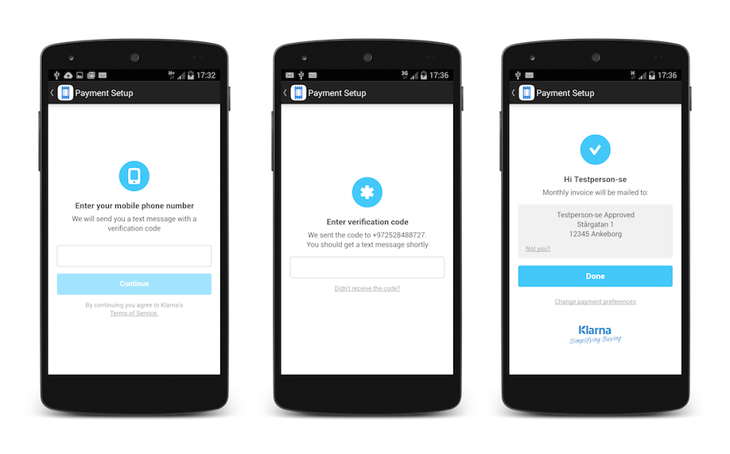

# Klarna on Demand

Klarna on-demand allows you to integrate Klarna's payment solution in mobile apps that offer on demand services. It's a perfect fit for apps selling concert tickets, taxi rides, food pick-ups, etc.

This project contains Klarna's on-demand purchase SDK for Android 4+, as well as a sample application utilizing the SDK.

**Note:** This project is still a work in progress, and as such the documentation may be behind (or ahead) what is currently implemented.

While not necessary, the simplest way to get going with both the sample application and the SDK is to use [Gradle](https://www.gradle.org/) and so all the following instructions will focus on that approach. For an alternative approach, see the [official documentation (coming soon)](http://developers.klarna.com).

## Using the SDK
Have a look at the [integration guide](doc/integration.md) for full details on how to use our SDK in your application.

## Running the sample application
### Prerequisites
To run the application, you must first compile it. To that end, you will require the following:

1. The [Java Runtime Environment](http://www.oracle.com/technetwork/java/javase/downloads/index.html) (or the Java Development Kit, also through the link)
2. The [Android SDK](https://developer.android.com/sdk/installing/index.html?pkg=tools)
3. [Android SDK packages](https://developer.android.com/sdk/installing/adding-packages.html)

### Running the application
Simply clone the project repository and follow these steps:

1. Open a terminal and navigate to the repository.
2. Connect an android device to run the application on ([see below](#below)).
3. Type `./gradlew installDebug` into your terminal (if you work on Windows, type `gradlew.bat installDebug`).
4. The application is now installed on all connected devices. Run it.

### Running a local server
While the instructions above will get the application up and running, you will not be able to successfully perform purchases without a backend for the application to interact with. You should go [here](https://github.com/klarna/sample-ondemand-backend) and follow the instructions provided to get a sample backend running on your local machine.

Since the sample application expects the server to be running on the same "machine", you will not be able to see a fully functional application running on a physical device. We recommend running the sample application on an emulator, such as [Genymotion](https://www.genymotion.com).

### Problems?
There are quite a few things that could break along the way and prevent you from successfully running the application. Gradle will usually output very helpful error messages, but do let us know if you [have an issue](./issue) and we will do our best to help.

## Contributing
You'd like to help us out? That's great! Here's what you need to do in order to contribute.

### Prerequisites
As per [running the application](#running_the_application).

### Setup

1. Fork the project and clone your repository
2. Import the project into a Gradle-friendly work environment such as [Android Studio](http://developer.android.com/sdk/index.html) or [Eclipse](https://eclipse.org/) with [Gradle tooling support](https://github.com/spring-projects/eclipse-integration-gradle/)
3. Get busy

### Tests
Pull requests must include tests for their proposed fixes/functionality. We use [JUnit](http://junit.org/) to write our tests and you can find the tests themselves [here](klarna-on-demand/src/test/java/com/klarna/ondemand).

If you're using Android Studio, use the [following guide](https://github.com/klarna/klarna-on-demand-android/blob/master/doc/android_studio_setup.md) in order to setup a JUnit testing environment.

## License
Klarna on Demand is available under the Apache 2.0 license. See the [LICENSE](./LICENSE) file for more info.
